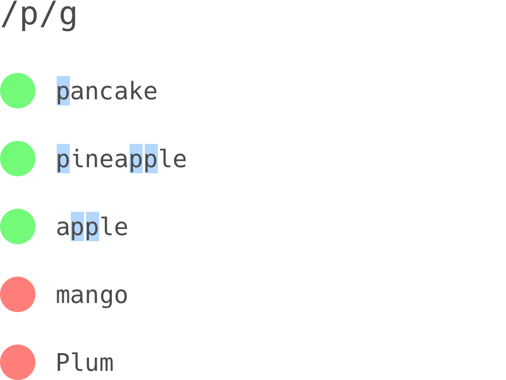

## Introduction

## Conventions

## Basics

Regular expressions are typically formatted as `/<rules>/<flags>`. Often people will drop the slashes and the flags for brevity. We’ll get into the details of flags in a later chapter, but the one you need to now now is `g`, which stands for “global”.

Let’s start with a very basic regex: `/p/g`.

As we can see, `/p/g` matches all lowercase `p` characters. Note that regexes are case sensitive by default. If the regex has one or more “matches” within the input string, it is said to “match” the regex. Think of “the matches” as an array, and whether an input “matches” a regex as a boolean.

## Character classes

It’s possible to match a character from one of several characters. Here’s an example:

![/[aeiou]/g](media/exported/[aeiou].png)

Our regex `/[aeiou]/g` matches all vowels in our input strings.

Here’s another example of these in action:

![/p[aeiou]t/g](media/exported/p[aeiou]t.png)

We match a `p`, followed by one of the vowels, followed by a `t`.

There’s an intuitive shortcut for matching a character from within a continuous _range_.

![/[a-z]/g](media/exported/[a-z].png)

We can combine ranges and individual characters in our regexes.

![/[A-Za-z0-9_-]/g](media/exported/[A-Za-z0-9_-].png)

Our regex `/[A-Za-z0-9_-]/g` matches a single character, which must be (at least) one of the following:

- from `A-Z`
- from `a-z`
- from `0-9`
- one of `_` and `-`.

We can also “negate” these rules:

![/[^aeiou]/g](media/exported/[^aeiou].png)

The only difference between the first regex of this chapter and `/[^aeiou]/g` is the `^` immediately after the opening bracket. Its purpose is to negate the rules defined within the brackets. We are now saying:

> “match any character that is _not_ any of _«blah»_, _«blah»_ or _«blah»_.

… instead of:

> “match any character that is at least one of _«blah»_, _«blah»_ and _«blah»_”

Here, _«blah»_ is either an individual character or a range of characters.

## Groups

Groups, as the name suggests, are meant to be used to “group” components of regular expressions. These groups can be used to:

- Extract subsets of matches
- Enhance readability
- Repeat groups an arbitrary number of times
- Make the group optional

We’ll see how to do a lot of this in later chapters, but learning how groups work will allow us to study some great examples in these later chapters.

## Alternation

## Repetition

### Making things optional

We can make parts of regex optional. We achieve this (among other things) using the `?` operator.

### Zero or more

If we wish to match zero or more of a token, we can suffix it with a `*`.

### One or more

If we wish to match zero or more of a token, we can suffix it with a `+`.

### Exactly `x` times

If we wish to match a particular token exactly `x` times, we can suffix with with `{x}`. This is functionally identical to repeatedly copy-pasting the token `x` times, but using `{x}` is often a lot less tedious.

### Between `min` and `max` times

If we wish to match a particular token between `min` and `max` times, we can suffix it with `{min,max}`.

Warning: There must be no space after the comma in `{min,max}`.

### At least `x` times

If we wish to match a particular token at least, we can suffix it with `{x,}`. Think of it as [`{min,max}`](#between-min-and-max-times), but without an upper bound.

### A note on *greediness*

## Flags

## Anchors

## Lookaround

## Using Regex

## Some words of caution

### RegEx DOS

### When not to use RegEx
